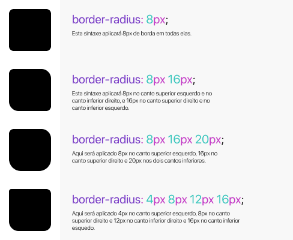
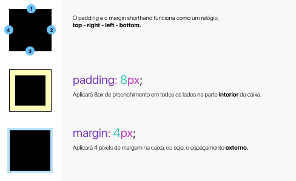

# Shorthand

É uma forma abreviada de escrever propriedades simultaneamente na mesma linha, juntando propriedades semelhantes.

* Economiza tempo, esforço;
* + légivel, simples e - verboso;
* Juntar propriedades.

## Exemplo

**Background**
```css
/* Background */

body {
    background-color: #DDD;
    background-image: url("./assets/image.jpg");
    background-repeat: no-repeat;
    background-position: left bottom; 
}

/* background shorthand */

body {
    background: #DDD url("./assets/image.jpg") no-repeat left bottom;
}
```
**Font***
```css
/* Font */
    h1 {
        font-family: SF Pro Display, sans-serif;
        font-style: italic;
        line-height: 1.3;
        font-weight: bold;
        font-size: 1.5em;
    }

    /* Font shorthand */

    h1 {
        font: SF Pro Display, sans-serif italic 1.5em/1.3 bold.;
    }
```

## Detalhes

* Um valor não mencionado no shorthand será resetado ao valor padrão, mesmo se já tenha declarado separadamente antes.
* apenas propriedades individuais são herdades, é impossível herdar uma propriedade numa sintaxe shorthand omitindo-a.
* A ordem das declarações em shorthand não tem importância, mas quando os valores são muito parecidos, podemos encontrar problemas.

## Bordas

**Border Radius**



Essa ordem serve também para a propriedade `border-width`

**Shorthand border**

```css
    /* Longhand */
    div {
        border-style: solid;
        border-width: 2px;
        border-color: #000;
    }

    /* Shorthand */
    div {
        border: solid 2px #000, 
    }
```

## Margin & Padding



Para aplicar valores diferentes nos lados basta aplicar o shorthand e respeitar a ordem no sentido horário.

**Nota**

* Um valor aplica ele para todos os lados.
* Dois valores = aplica o primeiro valor para em cima e em baixo e o segundo valor para os lados.
```css 
    div {
        padding: 4px 8px;
    }
```
* Três valore = aplica o primeiro em cima, o segundo nos lados e o terceiro em baixo.
```css 
    div {
        padding: 4px 8px 2px;
    }
```
* Quatro valores = aplica um em cada canto.
```css 
    div {
        padding: 2px 3px 4px 5px;
    }
```

**Tudo isso server para margin também.**

