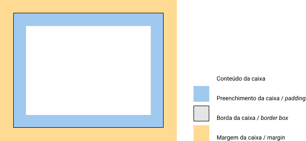

# Modelo de caixas

Os elementos html podem ser entendidos como caixas, pois apresentam características semelhantes à elas.



* (Quase) toda caixa tem tamanho, cor, borda, conteúdo, margem, preenchimento.
* As caixas podem ser agrupadas de várias formas como: Uma ao lado da outra, uma acima da outra.

## Exemplo da aula

**HTML**
```html 
    <h1>Evolua rápido como a tecnologia<span>.</span></h1>
    <p>Junte-se a milhares de devs e acelere na direção dos seus objetivos.</p>
    <button>Embarcar no foguete</button>
```

**CSS**
```css
    h1 {
        font-size: 50px
    }
    h1 span {
        color: green;
    }
```

No css as caixas por padrão serão exibidas uma abaixo da outra, isso é resultado da configuração do display block, que define que as caixas tenham comportamento em bloco, já a tag span ela possui a configuração de display inline, por isso ele fica ao lado.