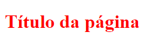

# Curso de CSS - "Guia estelar de CSS da Rocketseat"

## Introdução

**O que é e para que serve o CSS?**

Vamos iniciar pelo significado da sigla CSS: 

*Cascading Style Sheet*

Folhas de estilo em cascata.

* É usado para definir estilizações dos documentos HTML.
* O HTML funciona como a estrutura base, e o CSS embeleza esse documento.
* Não é considerada uma linguagem de programação pois não tem como fazer um algoritmo usando CSS. No entanto ela é uma linguagem para estilo.

### Exemplo

**HTML**
<pre><code>
    &lt;h1&gt;Título da página&lt;/h1&gt;
</code></pre>

**CSS**
<pre><code>
    h1 {
        color: red;
    }
</code></pre>

**Result**
<pre><code>
    
</code></pre>